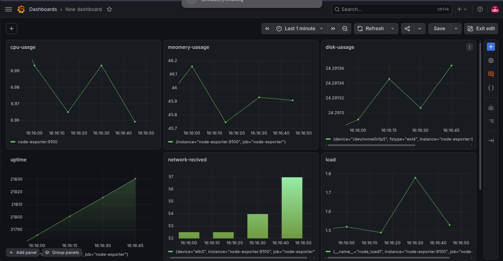

# Server Monitoring Stack

A containerized monitoring stack for observing Linux server health and performance using Prometheus, Node Exporter, and Grafana.

The project demonstrates a practical observability workflow: collecting host-level metrics, storing them as time-series data, and exposing them through a Grafana dashboard.

## Architecture

## Dashboard

The Grafana dashboard provides an overview of the Linux host's CPU, memory, disk, network, load, and uptime metrics.