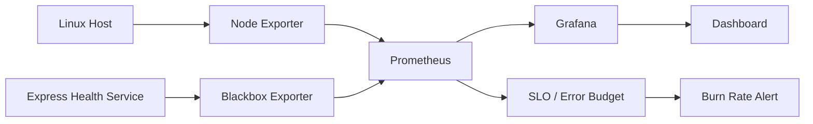
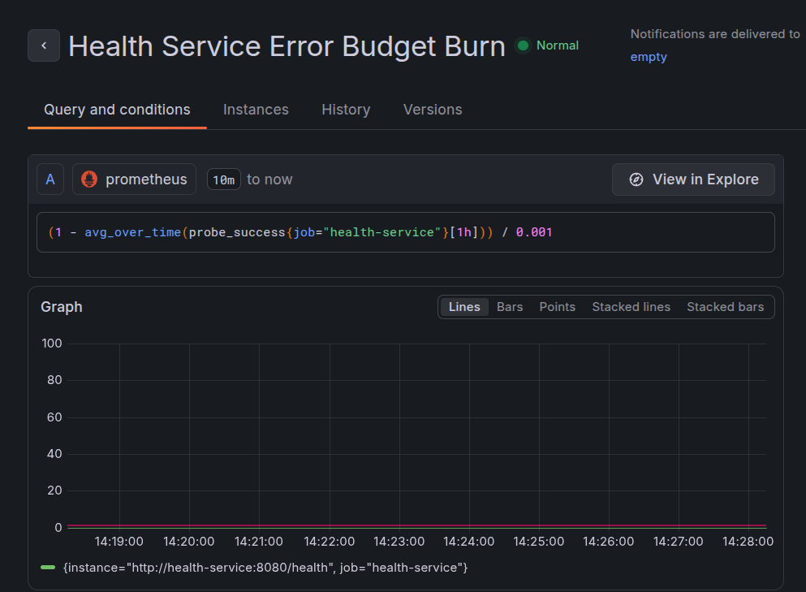
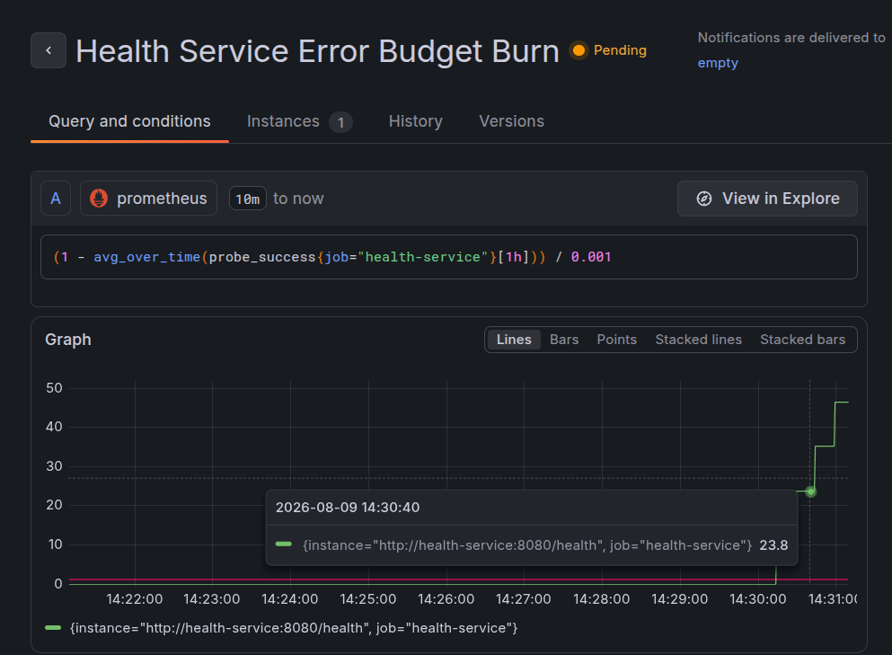
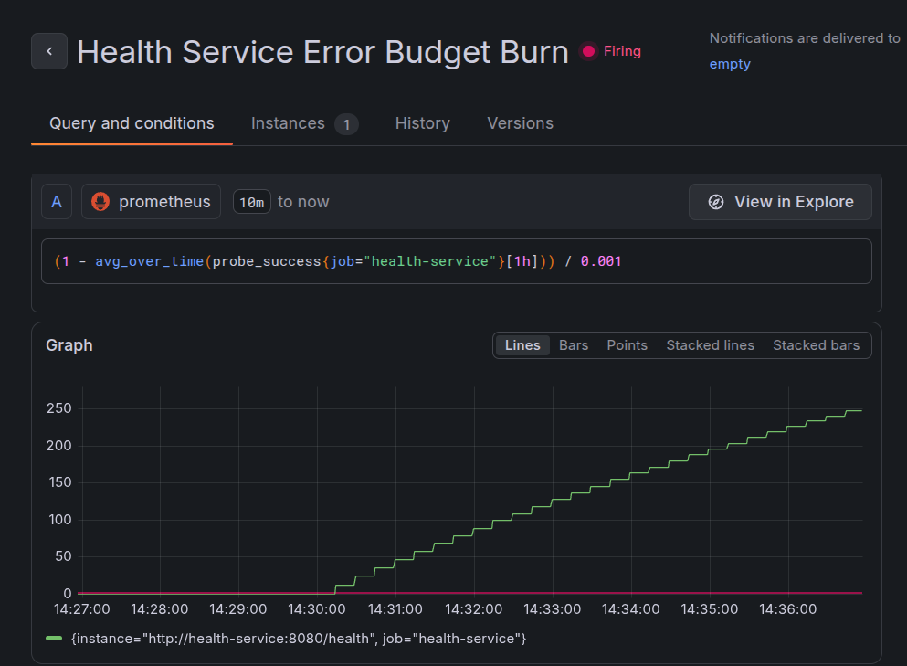
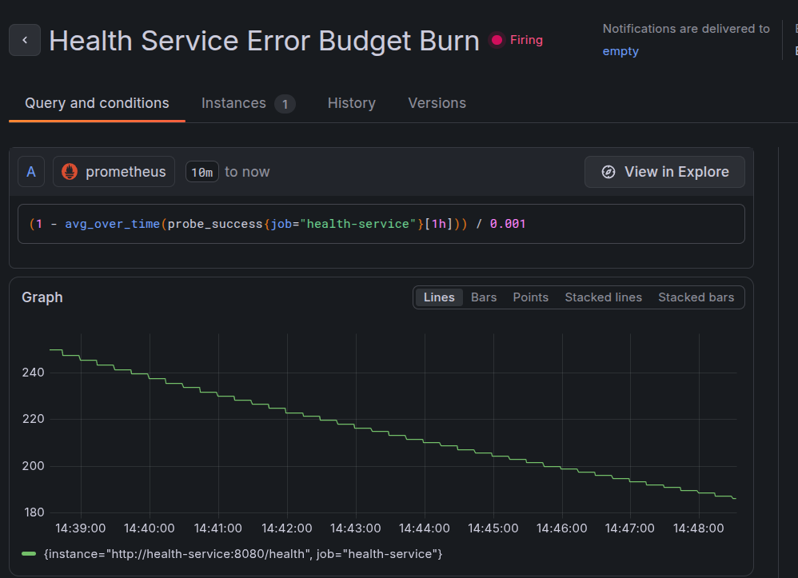

# Server Monitoring & SLO Stack

A containerized observability project that monitors Linux server health, measures application availability, and implements an SLO-based alerting workflow using Prometheus, Node Exporter, Blackbox Exporter, and Grafana.

The project demonstrates a practical DevOps/SRE monitoring pipeline:

- Host-level metrics collection
- Time-series monitoring with Prometheus
- HTTP availability monitoring
- SLO and error-budget calculation
- Burn-rate alerting
- Grafana visualization
- Failure and recovery testing

## Architecture

## Screenshots

### Grafana Dashboard

### Alert — Normal

### Alert — Pending

### Alert — Firing

### Alert — Recovered

