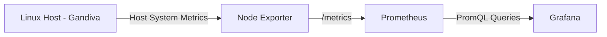

# Monitoring Stack — Technical Documentation

## 1. Project Overview

This project implements a containerized monitoring stack for a Linux host using:

- Node Exporter
- Prometheus
- Grafana
- Docker
- Docker Compose

The purpose of the project is to demonstrate a complete monitoring pipeline:

```text
Linux Host
    │
    │ System Metrics
    ▼
Node Exporter
    │
    │ Prometheus Metrics
    ▼
Prometheus
    │
    │ PromQL
    ▼
Grafana
    │
    ▼
Monitoring Dashboard
````

The stack is currently developed and tested locally on a Linux machine named `Gandiva`.

The project is intentionally being built locally first. Deployment to an external server is not currently part of the implementation scope.

---

# 2. Project Objective

The main objective is to build a system that can continuously observe the health and performance of a Linux machine.

Instead of manually checking system resources using commands such as:

```bash
top
free -h
df -h
```

the monitoring stack continuously collects metrics and makes them available for analysis and visualization.

The project demonstrates the following operational mindset:

> Measure system health continuously instead of assuming that the system is healthy.

The initial implementation focuses on infrastructure-level metrics.

The next phase will extend the project toward reliability monitoring by introducing:

* Service Level Objectives
* Error Budgets
* Error Budget Burn Rate
* Reliability-based alerting

---

# 3. Architecture

The current architecture consists of three containers running through Docker Compose.



## Component Responsibilities

### Linux Host

The Linux host is the system being monitored.

The host provides the underlying resources and operating-system information that we want to observe.

Examples include:

* CPU
* Memory
* Disk
* Network
* System load
* System uptime

---

### Node Exporter

Node Exporter acts as the metric exporter.

Its responsibility is to inspect the Linux host and expose system metrics in a format that Prometheus understands.

Node Exporter exposes a `/metrics` HTTP endpoint.

The default Node Exporter port is:

```text
9100
```

Example:

```text
http://localhost:9100/metrics
```

The endpoint contains Prometheus-compatible metrics such as:

```text
node_cpu_seconds_total
node_memory_MemAvailable_bytes
node_memory_MemTotal_bytes
node_filesystem_size_bytes
node_network_receive_bytes_total
node_network_transmit_bytes_total
```

Node Exporter does not store historical metrics.

Its primary responsibility is:

```text
Collect → Expose
```

---

# 4. Node Exporter Container

Node Exporter is containerized using Docker.

The relevant Docker Compose configuration is:

```yaml
node-exporter:
  image: prom/node-exporter:latest
  container_name: node-exporter
  restart: unless-stopped
  ports:
    - "9100:9100"
  command:
    - "--path.rootfs=/host"
  volumes:
    - "/:/host:ro,rslave"
```

## Configuration Breakdown

### Docker Image

```yaml
image: prom/node-exporter:latest
```

This instructs Docker to use the official Prometheus Node Exporter image.

Docker pulls the image if it is not already available locally.

The image acts as the template from which the Node Exporter container is created.

---

### Container Name

```yaml
container_name: node-exporter
```

The container is explicitly named `node-exporter`.

This makes container management and debugging easier.

For example:

```bash
docker ps
```

will display:

```text
node-exporter
```

---

### Restart Policy

```yaml
restart: unless-stopped
```

Docker will restart the container if it exits unexpectedly.

It also allows the container to restart after Docker/the host restarts.

The exception is when the container has been intentionally stopped.

---

# 5. Host Filesystem Access

Node Exporter is running inside a container, but the objective is to monitor the Linux host.

Therefore, it needs visibility into the host filesystem.

The configuration uses:

```yaml
volumes:
  - "/:/host:ro,rslave"
```

This creates a bind mount.

The mapping can be understood as:

```text
Host:
/

        ↓

Container:
/host
```

The host's root filesystem is mounted inside the Node Exporter container at:

```text
/host
```

The `ro` option means:

```text
read-only
```

Node Exporter can inspect the mounted filesystem but is not given write access through this mount.

This follows the principle of giving a monitoring component only the access it requires.

---

# 6. Root Filesystem Configuration

The container also uses:

```yaml
command:
  - "--path.rootfs=/host"
```

This tells Node Exporter that the host's root filesystem is available at:

```text
/host
```

Without this configuration, Node Exporter running inside a container could primarily observe the container environment rather than correctly accessing the host filesystem it is intended to monitor.

The combination of:

```yaml
volumes:
  - "/:/host:ro,rslave"
```

and:

```yaml
command:
  - "--path.rootfs=/host"
```

allows Node Exporter to operate as a containerized host monitoring agent.

---

# 7. Port Mapping

Node Exporter exposes metrics on port `9100`.

Docker Compose maps the container port to the host:

```yaml
ports:
  - "9100:9100"
```

This follows the format:

```text
HOST_PORT:CONTAINER_PORT
```

Therefore:

```text
Gandiva:9100
       │
       ▼
Node Exporter container:9100
```

This allowed the metrics endpoint to be tested directly from the host:

```bash
curl http://localhost:9100/metrics
```

A successful response contains Prometheus-formatted metrics.

For example:

```text
# HELP node_cpu_seconds_total ...
# TYPE node_cpu_seconds_total counter
node_cpu_seconds_total{...}
```

---

# 8. Verification — Node Exporter

The first verification step was checking the running container:

```bash
docker compose ps
```

Expected result:

```text
node-exporter   Up
```

The second verification step was checking the metrics endpoint:

```bash
curl http://localhost:9100/metrics
```

This confirmed that Node Exporter was:

1. Running successfully
2. Listening on port `9100`
3. Exposing Prometheus-compatible metrics

At this point the first monitoring component was operational.

---

# 9. Prometheus

Prometheus is responsible for collecting and storing metrics.

Node Exporter exposes metrics, but it does not provide the complete monitoring system.

Prometheus periodically requests metrics from exporters and stores the results as time-series data.

The conceptual flow is:

```text
Prometheus
    │
    │ "Give me your metrics"
    ▼
Node Exporter
    │
    │ Current host metrics
    ▼
Prometheus
    │
    ▼
Time-Series Storage
```

This allows historical analysis.

For example, Node Exporter can expose the current CPU state, while Prometheus allows us to query CPU behavior over a period of time.

---

# 10. Prometheus Container

Prometheus was added as a second Docker Compose service.

```yaml
prometheus:
  image: prom/prometheus:latest
  container_name: prometheus
  restart: unless-stopped
  volumes:
    - "./prometheus/prometheus.yml:/etc/prometheus/prometheus.yml:ro"
```

## Image

```yaml
image: prom/prometheus:latest
```

Docker uses the Prometheus image to create the Prometheus container.

---

## Configuration Mount

Prometheus requires a configuration file.

The project stores it locally at:

```text
prometheus/prometheus.yml
```

The file is mounted into the container at:

```text
/etc/prometheus/prometheus.yml
```

The mapping is:

```text
Project:
prometheus/prometheus.yml

        ↓

Prometheus container:
/etc/prometheus/prometheus.yml
```

The `ro` flag means the configuration is mounted read-only.

The purpose of this volume is to provide Prometheus with its configuration.

It is separate from the mechanism Prometheus uses to communicate with Node Exporter.

---

# 11. Prometheus Configuration

The current configuration is:

```yaml
global:
  scrape_interval: 15s

scrape_configs:
  - job_name: "node-exporter"
    static_configs:
      - targets:
          - "node-exporter:9100"
```

---

# 12. Scrape Interval

The global configuration contains:

```yaml
global:
  scrape_interval: 15s
```

This means Prometheus attempts to collect metrics every:

```text
15 seconds
```

Conceptually:

```text
Prometheus
    │
    │ Every 15 seconds
    ▼
Node Exporter
    │
    │ Metrics
    ▼
Prometheus
```

---

# 13. Scrape Configuration

The configuration defines a monitoring job:

```yaml
scrape_configs:
  - job_name: "node-exporter"
```

The job is named:

```text
node-exporter
```

This name identifies the monitoring target inside Prometheus.

The target is:

```yaml
targets:
  - "node-exporter:9100"
```

The hostname:

```text
node-exporter
```

is the Docker Compose service name.

Docker Compose provides networking between services in the stack, allowing Prometheus to communicate with the Node Exporter container using its service name.

The communication path is therefore:

```text
Prometheus container
        │
        │ HTTP
        ▼
node-exporter:9100
        │
        ▼
Node Exporter
```

---

# 14. Prometheus Target Verification

After starting the stack, Prometheus was queried using its internal HTTP API:

```bash
docker exec prometheus wget -qO- \
  http://localhost:9090/api/v1/targets
```

The response showed:

```text
job: "node-exporter"
health: "up"
```

This is important because it proves that the system is not merely running containers.

It confirms that:

```text
Prometheus
    │
    │ Successfully connects
    ▼
Node Exporter
```

and is actively scraping the target.

The target was configured with a:

```text
15 second scrape interval
```

---

# 15. Prometheus Configuration vs Docker Configuration

There are two different configuration layers in this project.

## Docker Compose

File:

```text
docker-compose.yml
```

Purpose:

> Tells Docker how to run the containers.

It defines things such as:

* Images
* Container names
* Restart policies
* Ports
* Volumes
* Commands

---

## Prometheus

File:

```text
prometheus/prometheus.yml
```

Purpose:

> Tells Prometheus how to perform monitoring.

It defines things such as:

* Scrape interval
* Monitoring jobs
* Targets

This distinction is important:

```text
docker-compose.yml
        ↓
How the application runs

prometheus.yml
        ↓
How Prometheus monitors systems
```

---

# 16. Grafana

Grafana is the visualization layer.

Prometheus is responsible for collecting and storing metrics.

Grafana is responsible for querying those metrics and presenting them in dashboards.

The relationship is:

```text
Node Exporter
      │
      ▼
Prometheus
      │
      ▼
Grafana
```

Grafana does not replace Prometheus.

Instead, Grafana uses Prometheus as its data source.

---

# 17. Grafana Container

Grafana was added as the third Docker Compose service:

```yaml
grafana:
  image: grafana/grafana:latest
  container_name: grafana
  restart: unless-stopped
  ports:
    - "3000:3000"
```

Grafana normally listens on port:

```text
3000
```

The port mapping allows the Grafana web interface to be accessed from the host.

```text
Gandiva:3000
      │
      ▼
Grafana container:3000
```

---

# 18. Grafana Data Source

Grafana was configured with Prometheus as its data source.

The Prometheus URL configured inside Grafana is:

```text
http://prometheus:9090
```

The hostname:

```text
prometheus
```

refers to the Prometheus Docker Compose service.

This works because Grafana and Prometheus are running within the same Docker Compose network.

The communication flow is:

```text
Grafana
   │
   │ HTTP
   ▼
prometheus:9090
   │
   ▼
Prometheus
```

Using `localhost:9090` from Grafana would refer to the Grafana container itself, not the Prometheus container.

---

# 19. Grafana Dashboard

A Grafana dashboard was created to visualize the metrics collected by Prometheus.

The dashboard currently contains:

* CPU utilization
* Memory utilization
* Disk utilization
* Network receive traffic
* Network transmit traffic
* System load
* System uptime

The dashboard provides a visual representation of the Linux host's current and historical resource behavior.

---

# 20. PromQL

Grafana uses PromQL to query Prometheus.

PromQL is the Prometheus Query Language.

The project uses PromQL to transform raw metrics into useful measurements.

## CPU Usage

The CPU panel uses:

```promql
100 - (avg by (instance) (rate(node_cpu_seconds_total{mode="idle"}[5m])) * 100)
```

Conceptually:

1. Obtain CPU idle time.
2. Calculate the rate of idle CPU time over five minutes.
3. Calculate the average across CPUs.
4. Convert idle percentage into used percentage.

The result is an approximate CPU utilization percentage.

---

# 21. Memory Usage

Memory usage is calculated using:

```promql
100 * (1 - node_memory_MemAvailable_bytes / node_memory_MemTotal_bytes)
```

The query uses:

```text
node_memory_MemTotal_bytes
```

for total memory and:

```text
node_memory_MemAvailable_bytes
```

for available memory.

The result is expressed as a percentage of memory currently being used.

---

# 22. Disk Usage

The dashboard uses:

```promql
100 * (1 - node_filesystem_avail_bytes{fstype!~"tmpfs|overlay",mountpoint="/"} / node_filesystem_size_bytes{fstype!~"tmpfs|overlay",mountpoint="/"})
```

This calculates the percentage of the root filesystem that is currently used.

Temporary and overlay filesystems are excluded from the calculation.

---

# 23. Network Receive Traffic

Network receive rate:

```promql
rate(node_network_receive_bytes_total{device!="lo"}[5m])
```

This measures the rate at which the host receives network traffic.

The loopback interface is excluded:

```text
device!="lo"
```

---

# 24. Network Transmit Traffic

Network transmit rate:

```promql
rate(node_network_transmit_bytes_total{device!="lo"}[5m])
```

This measures the rate at which the host sends network traffic.

---

# 25. System Load

The one-minute load average is exposed using:

```promql
node_load1
```

System load is different from CPU percentage.

It represents the amount of work competing for system resources and provides another view of system pressure.

---

# 26. System Uptime

System uptime is calculated using:

```promql
node_time_seconds - node_boot_time_seconds
```

This provides the amount of time elapsed since the system booted.

---

# 27. Verification Strategy

Each major component was verified independently before moving to the next layer.

## Node Exporter

Container:

```bash
docker compose ps
```

Metrics endpoint:

```bash
curl http://localhost:9100/metrics
```

Expected result:

Prometheus-formatted system metrics.

---

## Prometheus

Container:

```bash
docker compose ps
```

Target verification:

```bash
docker exec prometheus wget -qO- \
  http://localhost:9090/api/v1/targets
```

Expected:

```text
job: node-exporter
health: up
```

---

## Grafana

Grafana was accessed through:

```text
http://localhost:3000
```

Prometheus was configured as the Grafana data source.

A successful data-source connection confirmed that Grafana could communicate with Prometheus.

---

# 28. Current Architecture

The completed core monitoring pipeline is:

```text
                 Linux Host
                    Gandiva
                      │
                      │
             Host System Metrics
                      │
                      ▼
              ┌──────────────┐
              │ Node Exporter│
              │    :9100     │
              └──────┬───────┘
                     │
                     │ Scrape
                     ▼
              ┌──────────────┐
              │  Prometheus  │
              │    :9090     │
              └──────┬───────┘
                     │
                     │ PromQL
                     ▼
              ┌──────────────┐
              │    Grafana   │
              │    :3000     │
              └──────┬───────┘
                     │
                     ▼
             Monitoring Dashboard
```

---

# 29. Why Docker Compose?

Docker Compose was chosen because the project consists of multiple related services:

```text
Node Exporter
Prometheus
Grafana
```

Instead of starting each container manually, Compose provides a single declarative definition for the stack.

The entire stack can be started with:

```bash
docker compose up -d
```

and stopped with:

```bash
docker compose down
```

This makes the monitoring environment reproducible.

The same configuration can be used to recreate the stack on another Linux machine without manually configuring every container.

---

# 30. Current Project Status

## Completed

* [x] Project structure
* [x] Docker Compose setup
* [x] Node Exporter container
* [x] Host filesystem access for Node Exporter
* [x] Node Exporter metrics endpoint
* [x] Prometheus container
* [x] Prometheus configuration
* [x] Node Exporter scrape target
* [x] Prometheus target verification
* [x] Grafana container
* [x] Grafana → Prometheus data source
* [x] Grafana monitoring dashboard
* [x] CPU monitoring
* [x] Memory monitoring
* [x] Disk monitoring
* [x] Network monitoring
* [x] System load monitoring
* [x] Uptime monitoring

---

# 31. Next Phase — Reliability Monitoring

The current implementation focuses primarily on infrastructure observability.

The next phase will move from:

```text
"What are the server's resource levels?"
```

toward:

```text
"Is the service meeting its reliability objective?"
```

The project will introduce:

```text
Service Level Objective (SLO)
          │
          ▼
     Error Budget
          │
          ▼
     Burn Rate
          │
          ▼
   Reliability Alert
```

The objective is to avoid relying only on infrastructure-threshold alerts such as:

```text
CPU > 90%
```

Instead, alerts will be based on whether the system is consuming its allowed reliability budget too quickly.

This will make the project more representative of modern SRE/observability practices.

---

# 32. Lessons Learned So Far

### Observability is a pipeline

Monitoring is not just installing Grafana.

The complete chain is:

```text
Instrument / Export
        ↓
Collect
        ↓
Store
        ↓
Query
        ↓
Visualize
        ↓
Alert
```

In this project:

```text
Node Exporter
      ↓
Prometheus
      ↓
PromQL
      ↓
Grafana
      ↓
Future Alerting
```

### Configuration has different responsibilities

Docker Compose controls how the services run.

Prometheus configuration controls what Prometheus monitors.

Grafana configuration controls how metrics are queried and displayed.

Understanding these boundaries makes troubleshooting easier.

### Running containers is not enough

A container being in the `Up` state does not prove the monitoring pipeline works.

Each layer must be verified independently.

For example:

```text
Node Exporter Up
        ≠
Prometheus scraping Node Exporter
        ≠
Grafana successfully querying Prometheus
```

The project therefore verifies each connection explicitly.

---

# 33. Operational Commands

## Start

```bash
docker compose up -d
```

## View running services

```bash
docker compose ps
```

## View logs

```bash
docker compose logs
```

Specific service:

```bash
docker compose logs prometheus
```

```bash
docker compose logs grafana
```

```bash
docker compose logs node-exporter
```

## Stop

```bash
docker compose down
```

## Recreate containers

```bash
docker compose up -d --force-recreate
```

## Inspect containers

```bash
docker ps
```

---

