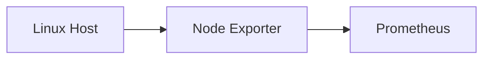
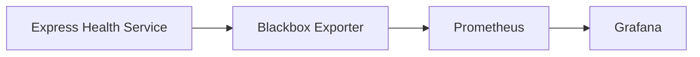

# Monitoring Stack — Technical Documentation

## 1. Overview

This project implements a containerized monitoring and reliability stack for a Linux system.

The project goes beyond basic infrastructure monitoring by combining:

- Host-level metrics
- Application availability monitoring
- Prometheus time-series collection
- Blackbox HTTP probing
- Grafana visualization
- Service Level Indicators (SLIs)
- Service Level Objectives (SLOs)
- Error budgets
- Burn-rate alerting
- Failure and recovery testing

The complete stack runs locally on Gandiva using Docker Compose.

---

# 2. Architecture

The monitoring architecture consists of two monitoring paths.

### Infrastructure monitoring

Node Exporter collects host-level metrics and exposes them for Prometheus.


Application reliability monitoring

The Express health service exposes /health. Blackbox Exporter performs an HTTP probe against the endpoint and reports the result to Prometheus.


Application Reliability Monitoring

The Express health service exposes /health. Blackbox Exporter performs an HTTP probe against the endpoint and reports the result to Prometheus.



Complete Architecture

```mermaid
flowchart LR
    H[Linux Host] --> NE[Node Exporter]
    NE --> P[Prometheus]

    APP[Express Health Service] --> BB[Blackbox Exporter]
    BB --> P

    P --> G[Grafana]

    G --> DASH[Dashboard]
    P --> SLO[SLO / Error Budget]
    SLO --> ALERT[Burn Rate Alert]
  ```


